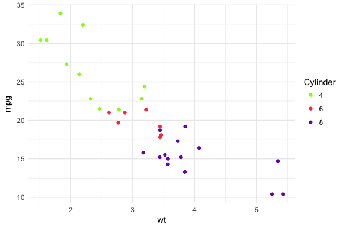
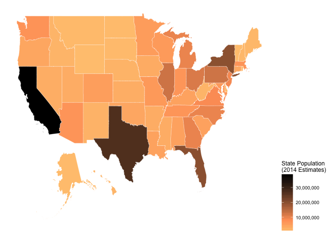
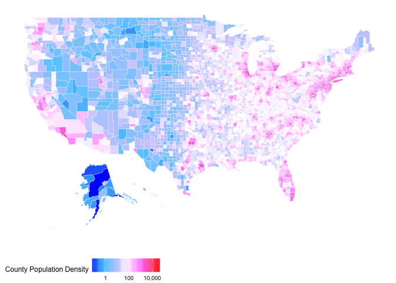

# Project Development Halted

This project is feature complete. There won't be any more development on this project.

---


<!-- README.md is generated from README.Rmd. Please edit that file -->
[](http://www.repostatus.org/#active) [](/commits/master) [](https://opensource.org/licenses/MIT) [](https://gist.github.com/bhaskarvk/46fbf2ba7b5713151d7e) [](https://travis-ci.org/bhaskarvk/colormap) [](https://ci.appveyor.com/project/bhaskarvk/colormap) [](https://cran.r-project.org/) [](commits/master) [](https://cran.r-project.org/package=colormap) [](http://cran.rstudio.com/web/packages/colormap/index.html)

Color Palettes from Node.js Colormap module.
--------------------------------------------

This is an R package that allows you to generate colors from color palettes defined in Node.js's [colormap](https://github.com/bpostlethwaite/colormap) module. In total it provides 44 distinct palettes made from sequential and/or diverging colors. In addition to the pre defined palettes you can also specify your own set of colors.

There are also scale functions that can be used with ggplot2.

#### Changelog

-   2016-11-15 0.1.4 With Viridis as default theme.
-   2016-10-21 0.1.3 Now on CRAN.
-   2016-09-06 Ability to generate a custom palette.
-   2016-08-30 Input Validation and ggplot2 scales.
-   2016-08-29 First Release.

### Credits

-   The [colormap](https://github.com/bpostlethwaite/colormap) Node.js module which does all the heavylifting.
-   The [V8](https://github.com/jeroenooms/V8) package which allows R code to call Javascript code.
-   [Bob Rudis](https://twitter.com/hrbrmstr)'s [zoneparser](https://github.com/hrbrmstr/zoneparser) package which I used as a skeleton for this pacakge.
-   [Simon Garnier](https://twitter.com/sjmgarnier)'s [viridis](https://github.com/sjmgarnier/viridis) package for ggplot2 scale functions.

### Installation

Requires [V8](https://cran.r-project.org/web/packages/V8/index.html)

``` r
if(!require("V8")) install.packages("V8")
if(!require("devtools")) install.packages("devtools")
devtools::install_github("bhaskarvk/colormap")
```

### Usage

The main function is `colormap` which takes 5 optional arguments

-   colormap: A string representing one of the 44 built-in colormaps.You can use the `colormaps` list to specify a value. e.g. `colormaps$density` **OR** A vector of colors in hex e.g. c('\#000000','\#777777','\#FFFFFF') **OR** A list of list e.g. list(list(index=0,rgb=c(255,255,255)),list(index=1,rgb=c(255,0,0)))
-   nshades: Number of colors to generate.
-   format: one of 'hex', 'rgb', 'rgbaString'
-   alpha: Between 0 & 1 to specify the transparency.
-   reverse: Boolean. Whether to reverse the order of the colors returned or not.

### Example

``` r
library(colormap)

# Defaults to 72 colors from the 'viridis' palette.
scales::show_col(colormap(), labels = F)
```


``` r

# Specify a different palette from a list of pre-defined palette.
scales::show_col(colormap(colormap=colormaps$temperature, nshades=20))
```


``` r

# Specify opacity value.
scales::show_col(colormap(colormap=colormaps$temperature, nshades=20, alpha=0.7))
```


``` r

# Specify colormap as vector of colors.
scales::show_col(colormap(colormap=c('#FFFFFF','#FF0000'),nshades = 12))
```


``` r

# Specify colormap as list of lists.
scales::show_col(colormap(colormap=list(list(index=0,rgb=c(0,255,0)),
                                        list(index=1,rgb=c(255,0,255))),
                          nshades=12, alpha=0.65))
```


You can also get the colors in a 'rgb' matrix and a rgba string vector format

``` r
colormap(format='rgb',nshades=5) # As rgb
#>      [,1] [,2] [,3] [,4]
#> [1,]   68    1   84    1
#> [2,]   59   81  139    1
#> [3,]   33  144  141    1
#> [4,]   92  200   99    1
#> [5,]  253  231   37    1

colormap(format='rgbaString',nshades=10) # As rgba string
#>  [1] "rgba(68,1,84,1)"    "rgba(71,39,117,1)"  "rgba(62,72,135,1)" 
#>  [4] "rgba(49,102,141,1)" "rgba(38,130,141,1)" "rgba(36,157,136,1)"
#>  [7] "rgba(55,181,120,1)" "rgba(109,204,88,1)" "rgba(176,221,49,1)"
#> [10] "rgba(253,231,37,1)"
```

You also get `scale_fill_colormap` and `scale_color_colormap` functions for using these palettes in ggplot2 plots. Check `?colormap::scale_fill_colormap` for details.

``` r
ensureCranPkg <- function(pkg) {
  if(!suppressWarnings(requireNamespace(pkg, quietly = TRUE))) {
    install.packages(pkg)
  }
}

ensureCranPkg('ggplot2')

library(ggplot2)

# Continuous color scale
ggplot(mtcars,aes(x=wt,y=mpg)) + geom_point(aes(color=hp)) +
  theme_minimal() +
  scale_color_colormap('Horse Power',
                       discrete = F,colormap = colormaps$viridis, reverse = T)
```


``` r

ggplot(mtcars,aes(x=wt,y=mpg)) + geom_point(aes(color=as.factor(cyl))) +
  theme_minimal() +
  scale_color_colormap('Cylinder',
                       discrete = T,colormap = colormaps$warm, reverse = T)
```



Here are two choroplethes using `scale_fill_colormap`.

``` r
ensureCranPkg('maptools')
ensureCranPkg('scales')
ensureCranPkg('ggplot2')
ensureCranPkg('ggthemes')
ensureCranPkg('devtools')

if(!suppressWarnings(requireNamespace('albersusa', quietly = TRUE))) {
  devtools::install_github('hrbrmstr/albersusa')
}

library(maptools)
#> Loading required package: sp
#> Checking rgeos availability: TRUE
library(scales)
library(ggplot2)
library(albersusa)
library(ggthemes)
library(colormap)

us <- usa_composite()
us_map <- fortify(us, region="fips_state")

gg_usa <- ggplot(us@data, aes(map_id=fips_state,fill=pop_2014)) +
  geom_map(map=us_map, color='#ffffff', size=0.1) + 
  expand_limits(x=us_map$long,y=us_map$lat) +
  theme_map() +  
  theme(legend.position="right") 

gg_usa +
  coord_map("albers", lat0=30, lat1=40) +
  scale_fill_colormap("State Population\n(2014 Estimates)", labels=comma,
                      colormap = colormaps$copper, reverse = T, discrete = F)
```



``` r


counties <- counties_composite()

counties_map <- fortify(counties, region="fips")

gg_counties <- ggplot(counties@data, 
                      aes(map_id=fips,fill=census_area)) +
  geom_map(map=counties_map, color='#ffffff', size=0.1) + 
  expand_limits(x=counties_map$long,y=counties_map$lat) +
  theme_map() +  
  theme(legend.position="right") 

gg_counties +
  coord_map("albers", lat0=30, lat1=40) +
  scale_fill_colormap("County Area", labels=comma, trans = 'log10',
                      colormap = colormaps$freesurface_red, reverse = T, discrete = F) +
  theme(#panel.border = element_rect(colour = "black", fill=NA, size=1),
        legend.position = 'bottom', legend.direction = "horizontal")
```



Here is a plot showing all 44 pre-defined color palettes and the colors they generate.

``` r
ensureCranPkg('purrr')
par(mfrow=c(44,1))
par(mar=rep(0.25,4))
purrr::walk(colormaps, function(x) { 
  barplot(rep(1,72), yaxt="n", space=c(0,0),border=NA,
          col=colormap(colormap=x), main = sprintf("\n\n%s",x))
  })
```


