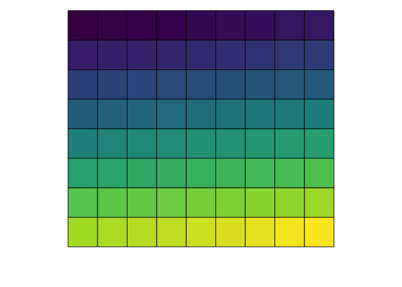
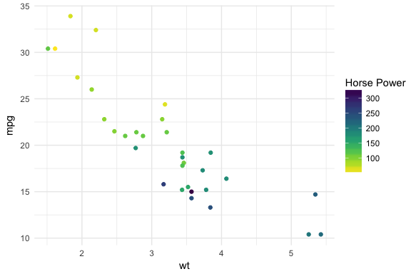

<!-- README.md is generated from README.Rmd. Please edit that file -->
Color Palettes from Node.js Colormap module.
============================================

This is an R package that allows you to generate colors from color palettes defined in Node.js's [colormap](https://github.com/bpostlethwaite/colormap) module. In total it provides 44 distinct palettes made from sequential and/or diverging colors. In addition to the pre defined palettes you can also specify your own set of colors.

There are also scale functions that can be used with ggplot2.

Credits
-------

-   The [colormap](https://github.com/bpostlethwaite/colormap) Node.js module which does all the heavylifting.
-   The [V8](https://github.com/jeroenooms/V8) package which allows R code to call Javascript code.
-   [Bob Rudis](https://twitter.com/hrbrmstr)'s [zoneparser](https://github.com/hrbrmstr/zoneparser) package which I used as a skeleton for this pacakge.
-   [Simon Garnier](https://twitter.com/sjmgarnier)'s [viridis](https://github.com/sjmgarnier/viridis) package for ggplot2 scale functions.

Updates
-------

[](https://travis-ci.org/bhaskarvk/colormap) [](https://ci.appveyor.com/project/bhaskarvk/colormap)

-   2016-09-06 Ability to generate a custom palette.
-   2016-08-30 Input Validation and ggplot2 scales.
-   2016-08-29 First Release.

Installation
------------

Requires [V8](https://cran.r-project.org/web/packages/V8/index.html)

``` r
if(!require("V8")) install.packages("V8")
if(!require("devtools")) install.packages("devtools")
devtools::install_github("bhaskarvk/colormap")
```

Usage
-----

The main function is `colormap` which takes 5 optional arguments

-   colormap: A string representing one of the 44 built-in colormaps.You can use the `colormaps` list to specify a value. e.g. `colormaps$density` **OR** A vector of colors in hex e.g. c('\#000000','\#777777','\#FFFFFF') **OR** A list of list e.g. list(list(index=0,rgb=c(255,255,255)),list(index=1,rgb=c(255,0,0)))
-   nshades: Number of colors to generate.
-   format: one of 'hex', 'rgb', 'rgbaString'
-   alpha: Between 0 & 1 to specify the transparency.
-   reverse: Boolean. Whether to reverse the order of the colors returned or not.

Example
-------

``` r
library(colormap)

# Defaults to 72 colors from the 'jet' palette.
scales::show_col(colormap(), labels = F)
```



``` r

# Specify a different palette from a list of pre-defined palette.
scales::show_col(colormap(colormap=colormaps$temperature, nshades=20))
```


``` r

# Specify opacity value.
scales::show_col(colormap(colormap=colormaps$temperature, nshades=20, alpha=0.7))
```


``` r

# Specify colormap as vector of colors.
scales::show_col(colormap(colormap=c('#FFFFFF','#FF0000'),nshades = 12))
```


``` r

# Specify colormap as list of lists.
scales::show_col(colormap(colormap=list(list(index=0,rgb=c(0,255,0)),
                                        list(index=1,rgb=c(255,0,255))),
                          nshades=12, alpha=0.65))
```


You can also get the colors in a 'rgb' matrix and a rgba string vector format

``` r
colormap(format='rgb',nshades=5) # As rgb
#>      [,1] [,2] [,3] [,4]
#> [1,]    0    0  131    1
#> [2,]    2  156  212    1
#> [3,]  128  255  130    1
#> [4,]  253  130    0    1
#> [5,]  128    0    0    1

colormap(format='rgbaString',nshades=10) # As rgba string
#>  [1] "rgba(0,0,131,1)"    "rgba(0,54,166,1)"   "rgba(2,134,202,1)" 
#>  [4] "rgba(4,224,242,1)"  "rgba(72,255,186,1)" "rgba(188,255,69,1)"
#>  [7] "rgba(254,215,0,1)"  "rgba(252,97,0,1)"   "rgba(238,0,0,1)"   
#> [10] "rgba(128,0,0,1)"
```

You also get `scale_fill_colormap` and `scale_color_colormap` functions for using these palettes in ggplot2 plots. Check `?colormap::scale_fill_colormap` for details.

``` r
library(ggplot2)

# Continuous color scale
ggplot(mtcars,aes(x=wt,y=mpg)) + geom_point(aes(color=hp)) +
  theme_minimal() +
  scale_color_colormap('Horse Power',
                       discrete = F,colormap = colormaps$viridis, reverse = T)
```



``` r

ggplot(mtcars,aes(x=wt,y=mpg)) + geom_point(aes(color=as.factor(cyl))) +
  theme_minimal() +
  scale_color_colormap('Cylinder',
                       discrete = T,colormap = colormaps$warm, reverse = T)
```


Here are two choroplethes using `scale_fill_colormap`.

``` r
library(maptools)
#> Loading required package: sp
#> Checking rgeos availability: TRUE
library(scales)
library(ggplot2)
library(ggalt)
#> ggalt is under *active* development. See https://github.com/hrbrmstr/ggalt for changes
library(albersusa)
library(ggthemes)
library(colormap)

us <- usa_composite()
us_map <- fortify(us, region="name")

gg_usa <- ggplot()
gg_usa <- gg_usa + geom_map(data=us_map, map=us_map,
                    aes(x=long, y=lat, map_id=id),
                    color="#2b2b2b", size=0.1, fill=NA)
gg_usa <- gg_usa + theme_map()
gg_usa <- gg_usa + 
  geom_map(data=us@data, map=us_map,
           aes(fill=pop_2014, map_id=name),
           color="white", size=0.1) +
  coord_proj(us_laea_proj) +
  theme(legend.position="right")

gg_usa +
  scale_fill_colormap("State Population\n(2014 Estimates)", labels=comma,
                      colormap = colormaps$copper, reverse = T, discrete = F)
```


``` r


counties <- counties_composite()

counties_map <- fortify(counties, region="fips")

gg_counties <- ggplot()
gg_counties <- gg_counties + geom_map(data=counties_map, map=counties_map,
                    aes(x=long, y=lat, map_id=id),
                    color="#2b2b2b", size=0.1, fill=NA)
gg_counties <- gg_counties + theme_map() +
  coord_proj(us_laea_proj, xlim = c(-122, -74.5 )) 
gg_counties <- gg_counties + 
  geom_map(data=counties@data, map=counties_map,
           aes(fill=population/census_area, map_id=fips),
           color="white", size=0.1)
gg_counties +
  scale_fill_colormap("County Population Density", labels=comma, trans = 'log10',
                      colormap = colormaps$picnic, reverse = F, discrete = F) +
  theme(#panel.border = element_rect(colour = "black", fill=NA, size=1),
        legend.position = 'bottom', legend.direction = "horizontal")
```


Here is a plot showing all 44 pre-defined color palettes and the colors they generate.

``` r
par(mfrow=c(44,1))
par(mar=rep(0.25,4))
purrr::walk(colormaps, function(x) { 
  barplot(rep(1,72), yaxt="n", space=c(0,0),border=NA,
          col=colormap(colormap=x), main = sprintf("\n\n%s",x))
  })
```


